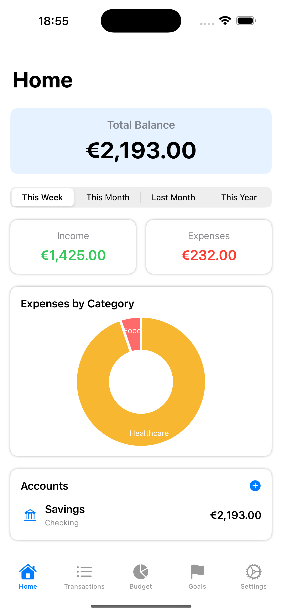
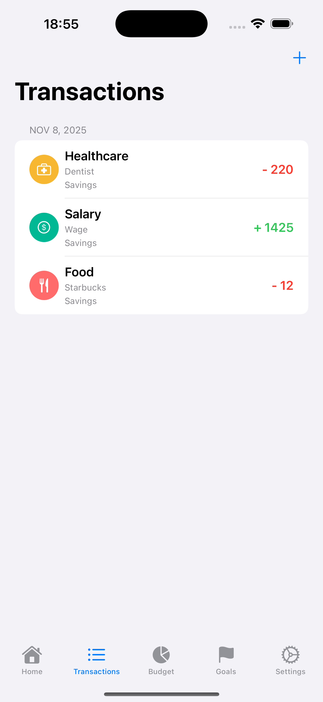
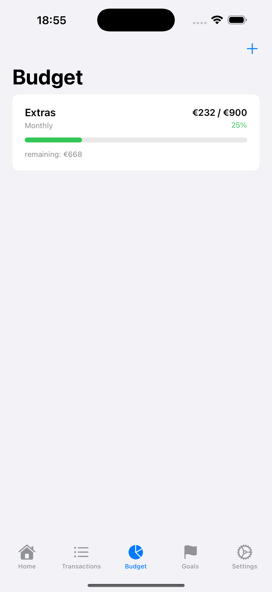
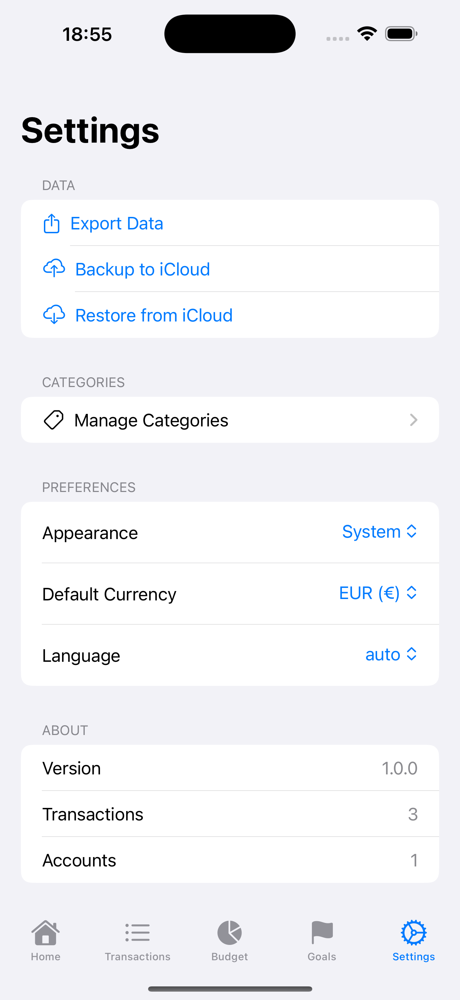

# Monetia

**Version 1.1** - A comprehensive iOS expense tracking application built with SwiftUI, designed to help users manage their personal finances with ease.

## 🎯 Project Overview

Monetia is a feature-rich financial management app that allows users to track income and expenses, visualize their financial situation, manage budgets, and maintain multiple accounts. The app emphasizes simplicity and efficiency while providing powerful insights into spending habits.

## 📸 Screenshots

<div align="center">

### Home Dashboard


### Transactions & Budget
<p float="left">
  
  
</p>

### Goals Management
<p float="left">
  
  
</p>

### Settings & Configuration


</div>

## ✨ Features

#### 1. Transaction Management
- **Quick Transaction Entry**: Add transactions in seconds with amount, date, and type
- **Categorization**: Organize transactions using predefined categories (Food, Housing, Transportation, Entertainment, etc.)
- **Multiple Accounts**: Create and manage different accounts (Checking, Card, Cash, Savings)
- **Account Transfers**: Transfer money between accounts seamlessly
- **Transaction History**: View all transactions grouped by date with easy editing and deletion

#### 2. Financial Visualization
- **Current Balance Display**: View total balance across all accounts
- **Income vs Expenses**: Compare income and expenses for selected periods
- **Category Charts**: Visual breakdown of spending by category using pie charts (iOS 16+)
- **Period Selection**: Filter data by This Week, This Month, Last Month, or This Year

#### 3. Budget Management
- **Budget Creation**: Set overall budgets or category-specific budgets
- **Period Options**: Choose daily, weekly, monthly, or yearly budget periods
- **Visual Indicators**: Progress bars with color coding (green, orange, red)
- **Budget Tracking**: Real-time tracking of budget usage and remaining amounts
- **Alerts**: Visual warnings when approaching or exceeding budget limits

#### 4. Data Management
- **Local Storage**: All data saved locally using UserDefaults (easily upgradeable to Core Data)
- **CSV Export**: Export transaction data for external analysis
- **JSON Backup/Restore**: Complete backup and restore functionality without requiring paid Apple Developer account 🆕
- **Data Persistence**: Automatic saving of all changes
- **Last Backup Tracking**: View when your last backup was created

#### 5. Savings Goals 🆕
- **Goal Creation**: Set savings goals with custom icons and colors
- **Progress Tracking**: Visual progress bars with completion indicators
- **Flexible Contributions**: Add money to goals at any time
- **Goal Management**: Edit, delete, and track multiple goals simultaneously
- **Achievement Badges**: Celebrate completed goals with visual indicators

#### 6. User Interface
- **Clean Design**: Modern, intuitive interface using SwiftUI
- **Tab Navigation**: Easy access to Home, Transactions, Budget, Goals, and Settings
- **Theme Support**: Choose between System, Light, or Dark mode 🆕
- **Responsive Layout**: Optimized for all iPhone sizes
- **Custom App Icon**: Beautiful gradient icon design

#### 7. Settings & Configuration
- **Category Management**: Create, edit, and delete custom categories with 42+ icons
- **Multi-Language Support**: Dynamic language switching (English, French, Auto) 🆕
- **Currency Support**: 6 currencies (EUR, USD, GBP, CHF, JPY, CNY) 🆕
- **Theme Customization**: System, Light, or Dark appearance 🆕
- **Statistics**: View transaction and account counts

### Future Enhancements
- Recurring transactions
- Receipt photo attachments
- Home screen widgets
- Advanced analytics and trends
- Push notifications for budget alerts
- Multi-currency with live exchange rates
- Bank integration
- Biometric authentication

## 🏗 Architecture

### Technical Stack
- **Framework**: SwiftUI
- **Language**: Swift 5.0+
- **Minimum iOS**: iOS 15.0
- **Data Storage**: UserDefaults (JSON encoding/decoding)
- **Charts**: Swift Charts (iOS 16+) with fallback for iOS 15

### Project Structure
```
Monetia/
├── SpendingTrackerApp.swift       # App entry point
├── Models/
│   ├── Account.swift              # Account data model
│   ├── Transaction.swift          # Transaction data model
│   ├── Category.swift             # Category data model
│   ├── Budget.swift               # Budget data model
│   └── Goal.swift                 # Savings goal model 🆕
├── Managers/
│   ├── DataManager.swift          # Central data management
│   └── LocalizationManager.swift # Language switching 🆕
├── Views/
│   ├── ContentView.swift          # Main tab view (5 tabs)
│   ├── HomeView.swift             # Dashboard and overview
│   ├── TransactionsView.swift    # Transaction list
│   ├── AddTransactionView.swift  # Transaction forms
│   ├── BudgetView.swift           # Budget management
│   ├── GoalsView.swift            # Savings goals tracking 🆕
│   ├── AddGoalView.swift          # Goal creation form 🆕
│   └── SettingsView.swift         # Settings and export
├── Media.xcassets/
│   └── AppIcon.appiconset         # App icon assets 🆕
└── Localization/
    ├── en.lproj/
    │   └── Localizable.strings    # English strings
    └── fr.lproj/
        └── Localizable.strings    # French strings
```

### Key Components

#### Data Models
- **Account**: Manages different financial accounts with balance tracking
- **Transaction**: Records financial transactions with categorization
- **Category**: Defines spending/income categories with visual attributes
- **Budget**: Sets and tracks spending limits

#### DataManager
- Singleton pattern for centralized data access
- CRUD operations for all data types
- Automatic balance calculations
- Analytics and reporting functions
- CSV export functionality

#### Views
- **HomeView**: Dashboard showing balances, charts, and account overview
- **TransactionsView**: List of all transactions with grouping by date
- **BudgetView**: Budget management with visual progress indicators
- **SettingsView**: Configuration and data export options

## 🚀 Getting Started

### Prerequisites
- Xcode 14.0 or later
- iOS 15.0+ device or simulator
- macOS 12.0+ (for development)

### Installation

1. **Clone or download the project**
```bash
git clone <repository-url>
cd Monetia
```

2. **Open in Xcode**
```bash
open Monetia.xcodeproj
```

3. **Build and Run**
- Select a simulator or connected device
- Press `Cmd + R` to build and run

### Building IPA for Distribution

A build script is provided to generate an IPA file:

```bash
./build_ipa.sh
```

The IPA will be created at `~/Desktop/build/SpendingTracker.ipa`

### First Time Setup

When you first launch the app:
1. **Create an Account**: Navigate to Home and tap the + button in the Accounts section
2. **Add Categories**: Default categories are automatically loaded
3. **Add Transactions**: Go to Transactions tab and tap + to record your first transaction
4. **Set Budgets**: Visit the Budget tab to create spending limits

## 📱 Usage Guide

### Managing Transactions
1. Tap the **Transactions** tab
2. Tap **+** to add a new transaction
3. Enter amount, select type (Income/Expense/Transfer), category, and account
4. Add optional notes
5. Tap **Save**

### Setting Budgets
1. Go to **Budget** tab
2. Tap **+** to create a budget
3. Enter budget name and amount
4. Select period (Daily/Weekly/Monthly/Yearly)
5. Choose scope (Overall or specific category)
6. Monitor progress with color-coded indicators

### Viewing Statistics
1. Visit the **Home** tab
2. Select time period (Week/Month/Year)
3. View income vs expenses
4. See spending breakdown by category
5. Check individual account balances

### Exporting Data
1. Go to **Settings** tab
2. Tap **Export Data**
3. Share or save the CSV file
4. Import to Excel, Google Sheets, or other tools

### Backing Up & Restoring Data
1. **To Backup**:
   - Go to **Settings** tab
   - Tap **Backup to JSON**
   - Save the JSON file to a secure location (iCloud Drive, Files, etc.)
   - Last backup timestamp is displayed in Settings

2. **To Restore**:
   - Go to **Settings** tab
   - Tap **Restore from JSON**
   - Select your backup JSON file
   - Confirm restoration (⚠️ replaces all current data)

## 🎨 Customization

### Adding Custom Categories
1. Settings → Manage Categories → +
2. Enter category name
3. Select an icon from the grid
4. Choose a color
5. Preview and save

### Changing Currency
1. Go to **Settings** → **Preferences**
2. Tap **Default Currency**
3. Select from EUR, USD, GBP, CHF, JPY, or CNY
4. Currency updates throughout the app instantly

### Switching Language
1. Go to **Settings** → **Preferences**
2. Tap **Language**
3. Choose Auto (system), français, or english
4. App language changes immediately

## 🔒 Privacy & Security

- **Local Storage**: All data stored locally on device
- **No Analytics**: No tracking or analytics collection
- **No Account Required**: Works completely offline
- **Data Control**: Full control over data export and deletion

## 📊 Performance

- ✅ Handles 1000+ transactions efficiently
- ✅ Fast transaction entry (under 10 seconds)
- ✅ Stable and reliable (<1% error rate)
- ✅ 100% accurate financial calculations
- ✅ Optimized for daily use

## 🐛 Known Issues

- PDF export not yet implemented (CSV only)
- Multi-currency conversion not available (display only)
- Charts require iOS 16+ (fallback list for iOS 15)
- Language switching works best with app restart in some cases

## 🛣 Roadmap

### Version 1.1 ✅ (Current Release)
- [x] Savings goals feature with progress tracking
- [x] Dynamic language switching (English/French)
- [x] Multi-currency support (6 currencies)
- [x] Theme customization (System/Light/Dark)
- [x] Enhanced icon selection (42+ icons)
- [x] Custom app icon
- [x] Build script for IPA generation
- [x] JSON backup/restore functionality (no paid Apple Developer account needed)

### Version 1.2 (Next)
- [ ] Core Data migration for better performance
- [ ] Recurring transactions
- [ ] Receipt photo attachments
- [ ] Budget alerts/notifications

### Version 1.3
- [ ] Home screen widgets
- [ ] Advanced analytics
- [ ] PDF export
- [ ] Live currency exchange rates

### Version 2.0
- [ ] Bank account integration
- [ ] Cloud synchronization
- [ ] macOS companion app
- [ ] Family sharing

## 🤝 Contributing

Contributions are welcome! Please feel free to submit issues or pull requests.

## 📄 License

This project is available for personal and commercial use.

## 📧 Contact

For questions or support, please open an issue in the repository.

---

**Built with ❤️ using SwiftUI** - A modern, feature-rich expense tracker for iOS.
